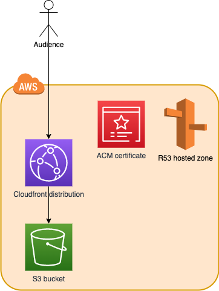

# CDK Static Website Deployment
Deploy a static website on AWS with CDK. 

## Requirements 
The app requires a Route53 hosted zone for the `WEBSITE_DOMAIN`, this zone has to be created manually before the script execution.

## How to use 
The CDK app relies on two environment variables 
- `WEBSITE_PATH` is the path to the directory which contains the website assets 
- `WEBSITE_DOMAIN` is the main root domain for your website 

`WEBSITE_PATH=../example.com/assets WEBSITE_DOMAIN=example.com cdk synth`

## Architecture diagram

1. The S3 bucket will host the static website files.
2. The CloudFront distribution will distribute the files hosted in the S3 bucket (1); all the requests will be processed in HTTPS.
3. The ACM certificate is created for your website and automatically attached to the CloudFront distribution (2).

You can now create two alias records in R53, pointing to the CloudFront distribution (2):
- `WEBSITE_DOMAIN` 
- and an alternative domain like `www.WEBSITE_DOMAIN` (e.g. `WEBSITE_DOMAIN` == example.com --> in R53 example.com + www.example.com); 

